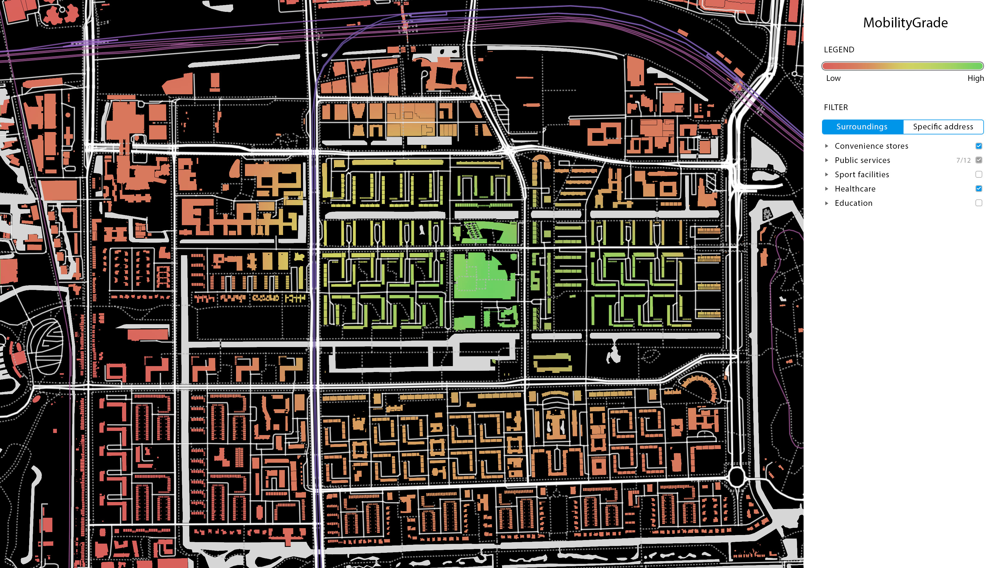

Mobility is an important quantifier for quality of life providing autonomy and a connection to the outside world. MobilityGrade aims to provide insights into mobility by connecting the availability of *quality of life*-services to their travel times and accessibility. Insights provided by MobilityGrade can then be used as a decision making factor by potential residents of that area, or to be considered during urban planning.

The initial focus and pilot area for MobilityGrade is [Buitenveldert](https://en.wikipedia.org/wiki/Buitenveldert), a neighbourhood in Amsterdam with a relatively high amount of elderly residents. This location was chosen because the stagnating personal mobility among the elderly asks for accessible means of transportation. The goal of MobilityGrade is to help residents and urban planners make informed estimations on how mobility impacts everyday life.

> Data is obtained from local open data repositories provided by [Amsterdam](https://data.amsterdam.nl/) and the [CBS](https://opendata.cbs.nl/). All efforts will be published as open source with the MIT License.

# Concept
MobilityGrade is a website that visualises residential mobility on a map. The aim is to have a *mobility grade*—a summary of various mobility metrics—visible for each residential address on the map. Mobility metrics may include the availability of health care, education, or grocery stores with an emphasis on travel time and accessibility.

Because people have varying personal mobility—and to promote a healthy city—the means of transportation is weighed in to the overall mobility grade for each address. An address where the local library is available by bike will score higher than if a car is required. Because not everyone will be interested in *visiting the library* it can be excluded from the overall mobility grades using filters.

> Initial sketch for what MobilityGrade may look like.

